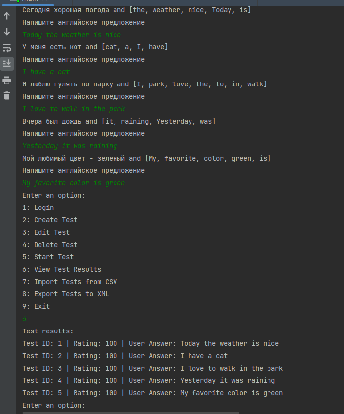
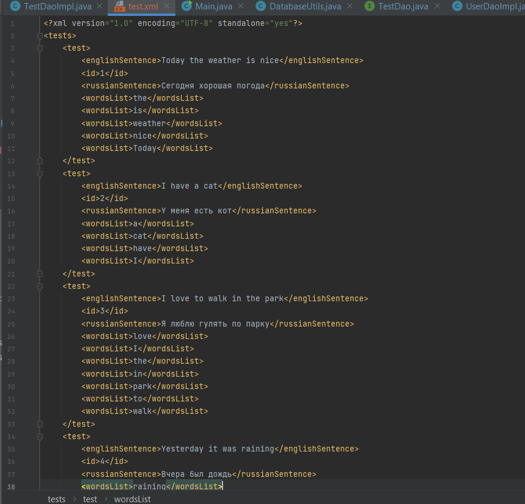
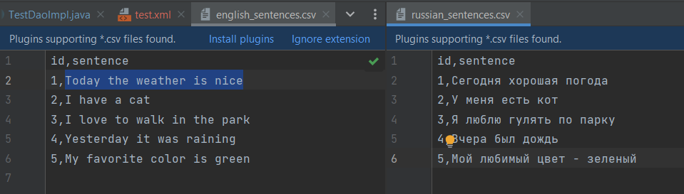
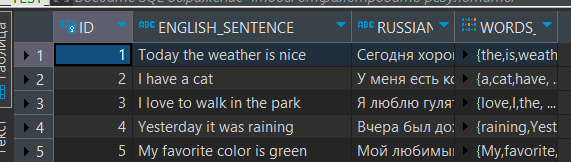

# Примеры запуска программы

Так же нужно добавить библиотеки из папки lib
File -> project structure -> + все библиотеки из папки

Как работает:
Запустить класс Main
Нужно ввести логин и пароль, если логин и пароль admin admin, то заход под админа
Далее нужно создать тест(1), либо импортировать(6) из csv файлов введя путь до файлов

Нужно начать тест(4)
После прохождения теста можно посмотреть результаты

Чтобы выйти нажать 9

Пример №1:

export to xml

import from csv:

to database:

